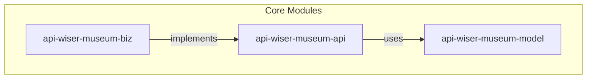
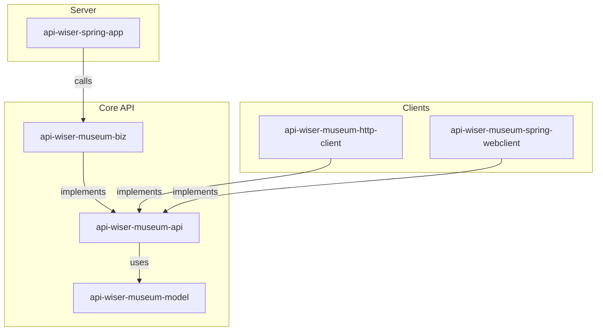

# API Wiser Showcase: Redocly Museum API

This project showcases the capabilities of **API Wiser**, a tool designed to accelerate API development by generating a structured, multi-module Maven project directly from an OpenAPI specification. In this showcase, we will use Redocly's [Museum API](https://redocly.com/demo/openapi/museum-api) (OpenAPI 3.1.0) to demonstrate how to generate a project, implement business logic, and expose it as a Spring Boot application.

To learn more about the core project, visit the [API Wiser repository](https://github.com/org-metalib/api-wiser).

## Prerequisites

Before you begin, ensure you have the following installed and configured on your system:

1. **Java Development Kit (JDK):** Required by Maven to build the project.
2. **Apache Maven:** The build automation tool for this project. You can verify your installation by running `mvn -v`.
3. **IntelliJ IDEA:** An integrated development environment (IDE). We will use the command-line launcher `idea`.
4. **Internet Access:** Maven requires internet access to download project dependencies.
5. **Write Permissions:** Ensure you have write permissions in your target directory.

## 1\. Generate the Maven Project

With the [api-wiser-museum.yaml](api/api-wiser-museum.yaml) OpenAPI specification in place, run the following command to generate the project structure using the API Wiser Maven archetype:

```shell
mvn archetype:generate -B \
  -DarchetypeGroupId=org.metalib.api.wiser \
  -DarchetypeArtifactId=api-wiser-archetype \
  -DarchetypeVersion=0.0.12 \
  -DgroupId=org.metalib.api.demo.showcase.museum \
  -DartifactId=api-wiser-museum \
  -Dopenapi=api/api-wiser-museum.yaml \
  -Dversion=0.0.1-SNAPSHOT
```

This command generates a multi-module Maven project with a clean separation of concerns:

* `api-wiser-museum-model`: Contains the Java data models generated from the OpenAPI schema.
* `api-wiser-museum-api`: Contains the Java interfaces for the API.
* `api-wiser-museum-biz`: A skeleton module for implementing the business logic of the API.

Here is a visual representation of the generated modules:



Next, navigate into the newly created project directory and run Maven's `initialize` goal. This step is crucial as it allows API Wiser to apply final configurations to the `pom.xml` files.

```shell
cd api-wiser-museum
mvn initialize
```

## 2\. Implement the Business Logic

Now, let's add the business logic for the `getMuseumHours` endpoint. Open the following file: 
[MuseumHoursBiz.java](api-wiser-museum/api-wiser-museum-biz/src/main/java/org/metalib/api/demo/showcase/museum/biz/MuseumHoursBiz.java)
and add the following implementation to the `getMuseumHours` method:

```java
@Override
public List<MuseumDailyHours> getMuseumHours(LocalDate startDate, Integer page, Integer limit) {
  return List.of(MuseumDailyHours.builder()
          .date(startDate)
          .timeOpen("08:00am")
          .timeClose("6:00pm")
          .build());
}
```

With the business logic in place, build the project:

```shell
cd api-wiser-museum
mvn clean install
```

## 3\. Expose the API with Spring Boot

So far, we have mapped our OpenAPI specification to a set of core modules. Now, let's expose our API over HTTP using the API Wiser Spring App template.

Run the following commands to add the Spring Boot module to your project.

```shell
cd api-wiser-museum
mvn api:templates -Dapi-wiser.templates='api-wiser-spring-app-templates'
mvn initialize
mvn initialize
```

* The `api:templates` goal adds the `api-wiser-spring-app-templates` template as a dependency.
* The subsequent `initialize` goals create and configure the `api-wiser-museum-spring-app` module in your `pom.xml`.

You now have a runnable Spring Boot application\! To start the server, run:

```shell
cd api-wiser-museum/api-wiser-museum-spring-app
mvn spring-boot:run
```

Your API is now available at `http://localhost:8080`.

## 4\. Generate HTTP Clients

To complete our project, let's generate two client implementations for our Museum API. These clients will allow other services to communicate with our new API.

```shell
cd api-wiser-museum
mvn api:templates -Dapi-wiser.templates='api-wiser-spring-webclient-template,api-wiser-http-client-templates'
mvn initialize
mvn initialize
```

This will add two new client modules to your project:

* `api-wiser-museum-spring-webclient`
* `api-wiser-museum-http-client`

## 5\. Test the Spring WebClient

Let's add an integration test to verify our `WebClient` implementation. First, add the Spring Boot test starter dependency to 
[pom.xml](api-wiser-museum/api-wiser-museum-spring-webclient/pom.xml)

```xml
<dependency>
    <groupId>org.springframework.boot</groupId>
    <artifactId>spring-boot-starter-test</artifactId>
    <scope>test</scope>
</dependency>
```

Next, build the project to include the new dependency:

```shell
cd api-wiser-museum
mvn clean install
```

Finally, create and run an integration test. The following script will create a test file for you:

```shell
TEST_CLASS_DIR=api-wiser-museum/api-wiser-museum-spring-webclient/src/test/java/org/metalib/api/demo/showcase/museum/spring/webclient
mkdir -p $TEST_CLASS_DIR
cat << EOF > $TEST_CLASS_DIR/MuseumHoursSpringWebclientTest.java
package org.metalib.api.demo.showcase.museum.spring.webclient;

import org.junit.jupiter.api.Test;
import org.springframework.web.reactive.function.client.WebClient;
import java.time.LocalDate;

import static org.junit.jupiter.api.Assertions.assertNotNull;

class MuseumHoursSpringWebclientTest {

    static WebClient webClient = WebClient.create("http://localhost:8080");

    @Test
    @Disabled("This test requires a running instance of the API")
    void getMuseumHours() {
        // Make sure your Spring Boot application is running before executing this test
        final var result = new MuseumHoursSpringWebclient(webClient).getMuseumHours(LocalDate.now(), 1, 10);
        assertNotNull(result);
    }
}
EOF
```

You can now open the project in IntelliJ IDEA and run the test.

```shell
idea api-wiser-museum
```

## Summary

By following these steps, API Wiser has generated a complete, production-ready application with a clean, decoupled architecture.

**Core Components:**

* `api-wiser-museum-model`: Defines the data structures.
* `api-wiser-museum-api`: Defines the API contracts (Java interfaces).
* `api-wiser-museum-biz`: Implements the API contracts with business logic.

**Client Implementations:**

* `api-wiser-museum-spring-webclient`: A Spring `WebClient` implementation of the API.
* `api-wiser-museum-http-client`: A standard Java `HTTP-Client` implementation of the API.

**Server Application:**

* `api-wiser-spring-app`: A Spring Boot application that serves the API by connecting the endpoints to the business logic.

This architecture promotes a clean separation of concerns, making the application easier to maintain, test, and scale.


