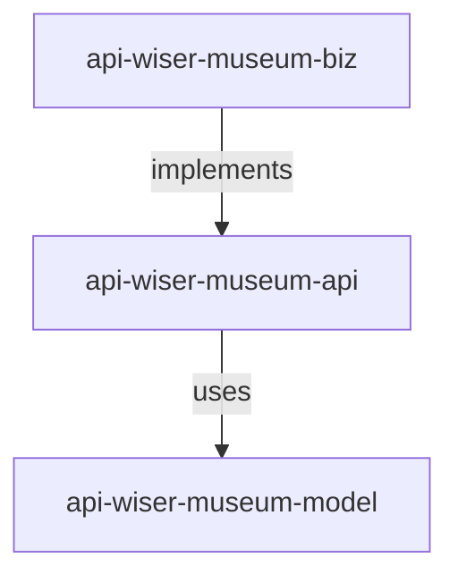
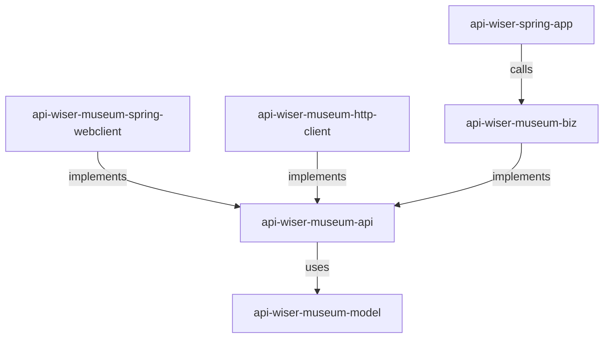

# Redocly Museum API with API Wiser

Redocly has a simple [Museum](https://redocly.com/demo/openapi/museum-api) openapi 3.1.0 we can use in our showcase.

## Prerequisites

1. Java Development Kit (JDK): Ensure the JDK is installed and configured, as Maven requires it to run.
2. Apache Maven Installed: Ensure Maven is installed and properly configured on your system. You can verify this by running mvn -v in the terminal.  
3. OpenAPI Specification File: The -Dopenapi parameter requires a valid OpenAPI specification file ([api/api-wiser-museum.yaml](api/api-wiser-museum.yaml) in this case).  
4. Internet Access: Maven may need to download dependencies and the archetype from a remote repository.  
5. Write Permissions: Ensure you have write permissions in the directory where the command is executed, as it will generate files there.
6. Intellij IDEA installed with configured cmd `idea` configured.

## Generate maven project

With openapi spec [api-wiser-museum.yaml](api/api-wiser-museum.yaml) in place, run the following `archetype:generate`: 
```shell
mvn archetype:generate -B \
  -DarchetypeGroupId=org.metalib.api.wiser \
  -DarchetypeArtifactId=api-wiser-archetype \
  -DarchetypeVersion=0.0.12 \
  -DgroupId=org.metalib.api.demo.showcase.museum \
  -DartifactId=api-wiser-museum \
  -Dopenapi=api/api-wiser-museum.yaml \
  -Dversion=0.0.1-SNAPSHOT
```

It generates a Maven project structure for the Redocly Museum API openapi spec. The output includes:
* A multi-module Maven project with the following modules:
  * `api-wiser-museum-model`: Contains the data models for the Museum API.
  * `api-wiser-museum-api`: Contains the API definitions and OpenAPI specification.
  * `api-wiser-museum-biz`: Contains business logic for the API.



Run maven's `initialize` goal for `api-wiser` to add the final configuration to the generated module `pom.xml`
```shell
cd api-wiser-museum
mvn initialize
```

Implement the `getMuseumHours` business logic in [MuseumHoursBiz.java](api-wiser-museum/api-wiser-museum-biz/src/main/java/org/metalib/api/demo/showcase/museum/biz/MuseumHoursBiz.java):
```java
  @Override
  public List<MuseumDailyHours> getMuseumHours(LocalDate startDate, Integer page, Integer limit) {
    return List.of(MuseumDailyHours.builder()
            .date(startDate)
            .timeOpen("08:00am")
            .timeClose("6:00pm")
            .build());
  }
```

Build the project:
```shell
cd api-wiser-museum
mvn clean install
```

## Open generated project with IntelliJ Idea  

If you have the idea command is installed and configured in the system path 
(as mentioned in the prerequisites), you can simply run:
```shell
idea api-wiser-museum 
```

## Spring Application Api Wiser template

So far we mapped our OpenAPI specification to three modules. We can expose it providing HTTP 
access through the special API Wiser Spring App

The following command adds the template as a dependency for api-wiser plugin in the project's `pom.xml`.
```shell
cd api-wiser-museum
mvn api:templates -Dapi-wiser.templates='api-wiser-spring-app-templates'
mvn initialize
mvn initialize
```
API Wiser `api:templates` goal adds the `api-wiser-spring-app-templates` template to the root module, the first
`initialize` goal creates and adds the `api-wiser-museum-spring-app` module to the `pom.xml`, and, finally,
the last `initialize` triggers API Wiser to add the module configuration to the `pom.xml`.

We just added spring boot module to the maven project. So we can even start it:
```shell
cd api-wiser-museum/api-wiser-museum-spring-app
mvn spring-boot:run
```

## Http Clients

To complete the picture we are adding two client implementing our Museum API to call the service via HTTP protocol.  
```shell
cd api-wiser-museum
mvn api:templates -Dapi-wiser.templates='api-wiser-spring-webclient-template,api-wiser-http-client-templates'
mvn initialize
mvn initialize
```

## Testing Spring Webclient

Add spring boot test dependency in [api-wiser-museum-spring-webclient](api-wiser-museum/api-wiser-museum-spring-webclient/pom.xml)
```xml
<dependency>
    <groupId>org.springframework.boot</groupId>
    <artifactId>spring-boot-starter-test</artifactId>
    <scope>test</scope>
</dependency>
```

Build the maven project
```shell
cd api-wiser-museum
mvn clean install
```


Add an integration test unit:
```shell
TEST_CLASS_DIR=api-wiser-museum/api-wiser-museum-spring-webclient/src/test/java/org/metalib/api/demo/showcase/museum/spring/webclient
mkdir -p $TEST_CLASS_DIR
cat << EOF > $TEST_CLASS_DIR/MuseumHoursSpringWebclientTest.java
package org.metalib.api.demo.showcase.museum.spring.webclient;

import org.junit.jupiter.api.Test;
import org.springframework.web.reactive.function.client.WebClient;
import java.time.LocalDate;

import static org.junit.jupiter.api.Assertions.assertNotNull;

class MuseumHoursSpringWebclientTest {

    static WebClient webClient = WebClient.create("http://localhost:8080");

    @Test
    void getMuseumHours() {
        final var result = new MuseumHoursSpringWebclient(webClient).getMuseumHours(LocalDate.now(), 1, 10);
        assertNotNull(result);
    }
}
EOF
```

We can run the test in the IDE:
```shell
idea api-wiser-museum 
```


## Summary

At the end of the day API Wiser generated three types of modules:

Core components:
* `api-wiser-museum-model`: Base data models
* `api-wiser-museum-api`: API definitions that use the model
* `api-wiser-museum-biz`: Business logic implementation of the API

Client implementations:
* `api-wiser-museum-spring-webclient`: Spring WebClient implementation
* `api-wiser-museum-http-client`: Java HTTP client implementation Both client components implement the API interfaces

Server application:
* `api-wiser-spring-app`: Spring Boot application that serves the API by calling the business logic implementation

The architecture follows a clean separation of concerns where:  
* Model defines the data structures
* API defines the contracts
* Multiple client implementations can consume the API
* Business logic implements the API contracts
* Spring application exposes the API via HTTP endpoints

